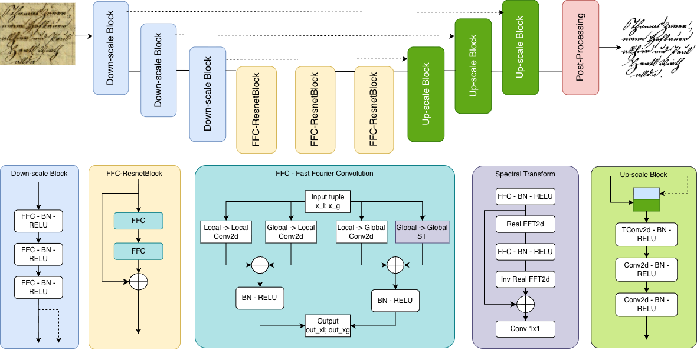

<div align="center">

# ✦ FourBi

### *See the Unseen. Restore the Unreadable.*

**A deep learning model that breathes new life into degraded document images —**
**by thinking in two dimensions at once.**

<br/>

[](https://huggingface.co/spaces/elnino1512/AI-Document-image-enhencement)
[](https://www.kaggle.com/datasets/elnino1512/final-dataset-binarization)
[](#citation)
[](#)

<br/>

> *"A water-stained manuscript. A centuries-old receipt. A faded letter from someone who mattered.*
> *FourBi was built for exactly these moments."*

<br/>

---

</div>

## The Problem Worth Solving

Every library, every archive, every hospital records room holds documents that are slowly disappearing — blurred by time, stained by water, faded by light, degraded by age. Standard binarization tools treat these images like puzzles with missing pieces. **FourBi treats them like signals with hidden structure.**

Most models look at a document and ask: *what do the pixels look like?*

FourBi asks a deeper question: **what does the document *mean* — in space, and in frequency?**

---

## How It Works

<div align="center">



</div>

FourBi is inspired by the ICDAR 2024 paper **"Binarizing Documents by Leveraging both Space and Frequency"**. Its key insight is elegant:

- **Spatial domain** → captures local structure, edges, and texture
- **Frequency domain** → captures global patterns, periodic noise, and signal consistency

By fusing both perspectives simultaneously, FourBi achieves binarization quality that neither approach reaches alone — especially on the most challenging real-world documents.

---

## Quick Start

**1. Set up your environment**

```bash
python3 -m venv venv
source venv/bin/activate
```

**2. Install dependencies**

```bash
pip install opencv-python wandb pytorch-ignite
```

**3. Install PyTorch** *(match your CUDA version)*

```bash
pip install torch torchvision torchaudio
```

**4. Run inference**

Open [`demo.ipynb`](demo.ipynb) and follow the notebook — your first restored document is minutes away.

---

## Project Structure

```
FourBi/
│
├── 📄 binarize.py              ← Run inference on any document image
├── 🧩 create_patches.py        ← Prepare training patches from raw data
├── 🚀 train.py                 ← Training entry point
│
├── 📂 data/                    ← Dataset loaders and augmentation pipelines
├── 📂 modules/                 ← Core model architecture (spatial + frequency)
├── 📂 trainer/                 ← Training loop, validation, loss, and optimizer
├── 📂 utils/                   ← Logging and experiment utilities
│
└── 📂 docs/
    └── architecture.png        ← Visual overview of the model
```

---

## Try It Now

No setup required — the live demo on Hugging Face Spaces lets you upload any document image and see FourBi restore it in seconds.

👉 **[Open the Live Demo](https://huggingface.co/spaces/elnino1512/AI-Document-image-enhencement)**

---

## Dataset

The training dataset is publicly available on Kaggle, curated specifically for document binarization research:

👉 **[Final Dataset Binarization](https://www.kaggle.com/datasets/elnino1512/final-dataset-binarization)**

After downloading, organize it according to the structure expected by [`create_patches.py`](create_patches.py) and the training scripts.

---

## Training

Full multi-dataset training is documented in:

👉 **[`train_multi_dataset.ipynb`](train_multi_dataset.ipynb)**

---

## Citation

If FourBi contributes to your research, please credit the original authors:

```bibtex
@inproceedings{quattrini2024binarizing,
  title     = {Binarizing Documents by Leveraging both Space and Frequency},
  author    = {Quattrini, Fabio and Pippi, Vittorio and Cascianelli, Silvia and Cucchiara, Rita},
  booktitle = {International Conference on Document Analysis and Recognition},
  pages     = {3--22},
  year      = {2024},
  organization = {Springer}
}
```

---

## About This Repository

This is a **rebuilt** version of FourBi — reconstructed from the original authors' work with the goal of making the source code cleaner, more reproducible, and easier to extend for future research. The core architecture, research direction, and intellectual contribution belong entirely to the original FourBi team.

This rebuild exists to honor that work, not replace it.

---

<div align="center">

**Questions? Ideas? Found a broken document FourBi couldn't handle?**

Reach out at **tdhuy1512@gmail.com**

<br/>

*Built with care for the documents that deserve to be read again.*

</div>

---

<details>
<summary>🇻🇳 Phiên bản Tiếng Việt</summary>

<br/>

## Câu Chuyện Đằng Sau FourBi

Trong mỗi thư viện, mỗi kho lưu trữ, mỗi phòng hồ sơ đều có những tài liệu đang dần biến mất — bị mờ theo thời gian, ố vàng vì nước, phai màu dưới ánh sáng. Các công cụ nhị phân hóa thông thường xử lý những ảnh này như những mảnh ghép bị thiếu. **FourBi tiếp cận chúng như những tín hiệu ẩn chứa cấu trúc sâu xa hơn.**

Hầu hết mô hình nhìn vào một tài liệu và hỏi: *các điểm ảnh trông như thế nào?*

FourBi đặt câu hỏi sâu hơn: **tài liệu này *có nghĩa gì* — trong miền không gian, và trong miền tần số?**

---

## Cách Hoạt Động

FourBi lấy cảm hứng từ bài báo ICDAR 2024 **"Binarizing Documents by Leveraging both Space and Frequency"**. Ý tưởng cốt lõi thật thanh lịch:

- **Miền không gian** → nắm bắt cấu trúc cục bộ, cạnh, và kết cấu
- **Miền tần số** → nắm bắt mẫu toàn cục, nhiễu tuần hoàn, và tính nhất quán của tín hiệu

Bằng cách kết hợp đồng thời cả hai góc nhìn, FourBi đạt được chất lượng nhị phân hóa mà riêng mỗi hướng tiếp cận đều không thể đạt được — đặc biệt trên những tài liệu thực tế khó xử lý nhất.

---

## Cài Đặt Nhanh

```bash
# Tạo môi trường ảo
python3 -m venv venv
source venv/bin/activate

# Cài đặt thư viện
pip install opencv-python wandb pytorch-ignite

# Cài đặt PyTorch (khớp với phiên bản CUDA của bạn)
pip install torch torchvision torchaudio
```

Mở [`demo.ipynb`](demo.ipynb) để chạy inference ngay lập tức.

---

## Huấn Luyện

Huấn luyện với nhiều dataset được cung cấp qua notebook:

[`train_multi_dataset.ipynb`](train_multi_dataset.ipynb)

---

## Dataset

Dataset huấn luyện được công bố công khai tại Kaggle:

[Final Dataset Binarization](https://www.kaggle.com/datasets/elnino1512/final-dataset-binarization)

---

## Về Repository Này

Đây là phiên bản **rebuild** của FourBi — được tái dựng từ công trình của nhóm tác giả gốc với mục tiêu làm cho mã nguồn sạch hơn, dễ tái lập hơn, và dễ mở rộng hơn cho nghiên cứu tương lai. Kiến trúc cốt lõi, hướng nghiên cứu, và đóng góp trí tuệ hoàn toàn thuộc về nhóm FourBi ban đầu.

Bản rebuild này tồn tại để tôn vinh công trình đó, không phải thay thế nó.

---

**Liên hệ:** tdhuy1512@gmail.com

</details>
